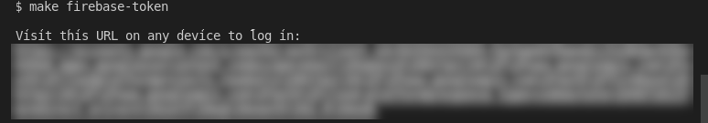
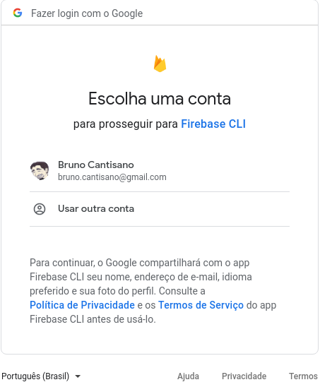
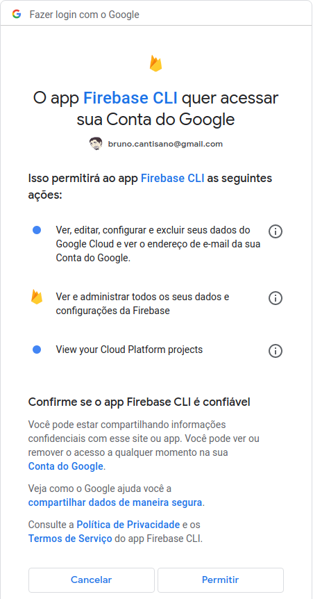
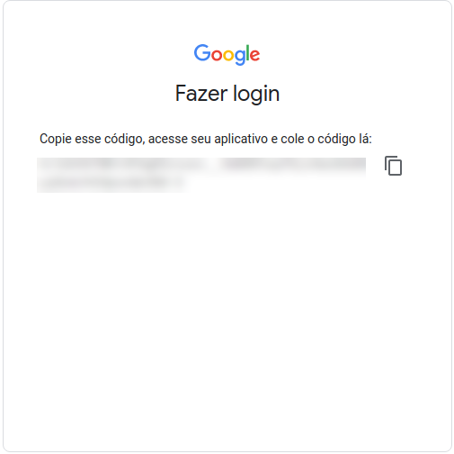
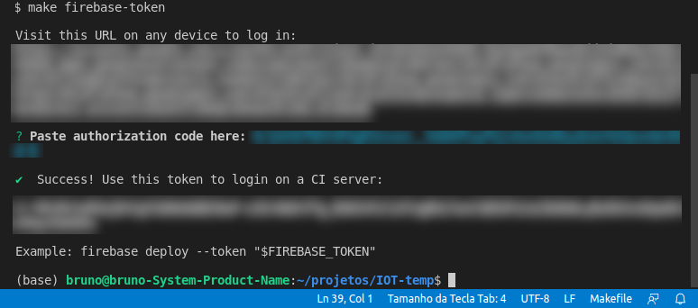
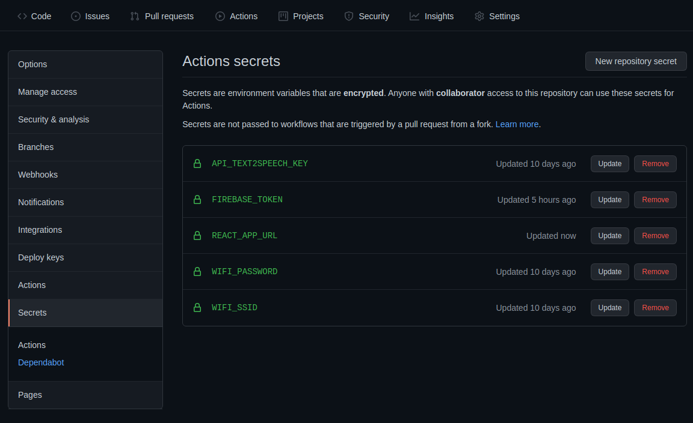

[](https://github.com/brunocantisano/iot-minion/actions/workflows/firebase.yml)


[](https://github.com/Naereen/StrapDown.js/blob/master/LICENSE)

Este projeto foi criado com [Create React App](https://github.com/facebook/create-react-app).

## Projeto no [Arduino](arduino/README.md)

## Pré Requisitos

1. Make

```bash
sudo apt install -y build-essential
```

2. Git secrets (para evitar de subir chaves de serviços dentro do código em repositórios públicos)

```bash
git clone https://github.com/awslabs/git-secrets.git && \
    cd git-secrets/ && \
    make install
```

* Para instalar checagens específicas de AWS e GCP:

```
git secrets --register-aws
git secrets --register-gcp
```

3. Environment Variables
```
export REACT_APP_URL="https://minion.local:3000"
export REACT_APP_API_MINION_TOKEN="bWluaW9uOkRlc3BpY2FibGVNZQ=="
```

**Base64**: `bWluaW9uOkRlc3BpY2FibGVNZQ==` é um exemplo de base64 criptografado no padrão `usuario`:`senha`
* usuário: `minion`
* senha: `DespicableMe`

3. Node Version: `v16.13.2`

4. Firebase tools:

```
npm install -g firebase-tools
```

## Github Actions (CI/CD)

* Para rodar o cicd do github e subir o projeto no firebase hosting, rode o comando make firebase-token e siga os passos. Após receber o token, cadastre na sessão `secrets` do seu repositório com o nome `FIREBASE_TOKEN` e adicione também a secret `REACT_APP_URL` com a url da api do arduino.








Referências: 

* [CSS switch minion](https://codepen.io/mohab-elhamzawy/pen/qOQKNB)
* [Personagem](http://cssdeck.com/labs/minions-css)
* [Termômetro](https://codepen.io/chrisgannon/pen/vjNNew/)
* [Evitar commit de chaves](https://betterprogramming.pub/how-you-can-prevent-committing-secrets-and-credentials-into-git-repositories-adffc25c2ea2)
* [Badges](https://github.com/brunocantisano/badges)

[](https://youtu.be/pUK80vrXUAI "iot-minion - Garagem Digital - Ipiranga")

* [Garagem Digital](https://www.garagemdigital.io/sentinela-da-garagem-digital/)

## Desenvolvedores/Contribuintes :octocat:

<table>
    <tr>
        <td align="center"><a href="https://github.io/brunocantisano"><br /><sub><b>Bruno Cantisano</b></sub></a><br /><a href="https://github.com/brunocantisano" title="Bruno Cantisano">:metal:</a></td>
        <td align="center"><a href="https://github.io/mauriciofragajr"><br /><sub><b>Mauricio Fraga Jr</b></sub></a><br /><a href="https://github.io/mauriciofragajr/" title="MAuricio Fraga">:sunglasses:</a></td>
        <td align="center"><a href="https://github.io/aferreirasv"><br /><sub><b>Alan Ferreira</b></sub></a><br /><a href="https://github.com/aferreirasv" title="Alan Ferreira">:v:</a></td>
        <td align="center"><a href="https://github.io/diogoalexandria"><br /><sub><b>Diogo Agra Alexandria</b></sub></a><br /><a href="https://github.com/diogoalexandria" title="Diogo Alexandria">:innocent:</a></td>
        <td align="center"><a href="https://github.io/AlvaroBeckerig"><br /><sub><b>Alvaro H. Beckerig</b></sub></a><br /><a href="https://github.com/AlvaroBeckerig" title="Álvaro Beckerig">:trollface:</a></td>
    </tr>
</table>
