# IOT-Minion

Robô caseiro feito na época da [quarentena](https://bigdata-covid19.icict.fiocruz.br/) com uma garrafa de sabonete líquido com o tema dos minions. [API](https://www.youtube.com/watch?v=OVvTv9Hy91Q&feature=emb_rel_pause) feita em REST e não SOAP. 😁

[SOAP 🆚 REST](https://www.infoq.com/br/articles/rest-soap-when-to-use-each/)

A aplicação consiste em três desenvolvimentos: 

- Backend feito na linguagem `C++` para rodar na placa [ESP8266](https://pt.wikipedia.org/wiki/ESP8266). Seu código-fonte encontra-se dentro da pasta `iot-minion`
- Frontend feito com a metodologia de desenvolvimento de software chamada de [PWA](https://www.garagemdigital.io/nativo-hibrido-ou-pwa), usando a linguagem `React`. Seu código-fonte encontra-se na pasta raíz do projeto.
- Interfaces de Conversação feita na linguagem `javascript` para ser utilizada no [Dialog Flow](https://en.wikipedia.org/wiki/Dialogflow) da Google. Encontra-se dentro da pasta `arduino/dialogFlow`

## Pre-requisitos

### Instalar placas que serão usadas

Adicionar no campo `URLs Adicionais para Gerenciadores de Placas` as linhas abaixo, **separadas por vírgulas**:

* http://arduino.esp8266.com/stable/package_esp8266com_index.json
* https://dl.espressif.com/dl/package_esp32_index.json


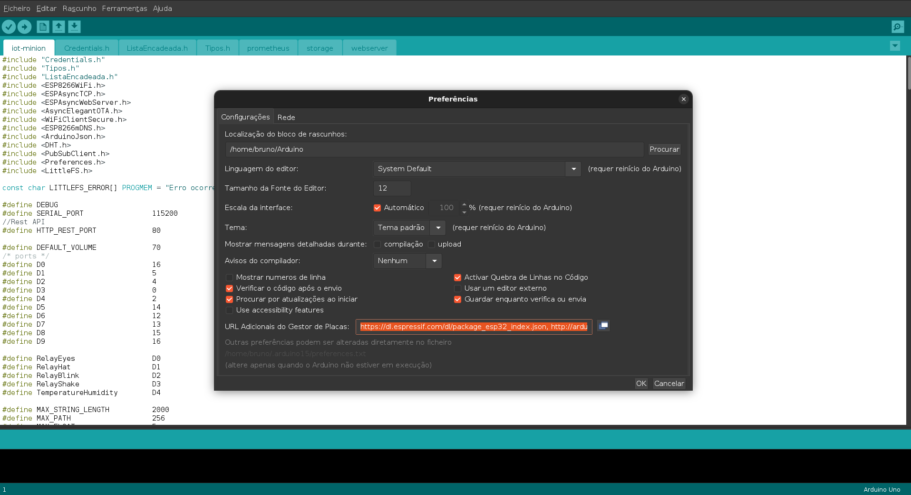

#### Instalar as placas

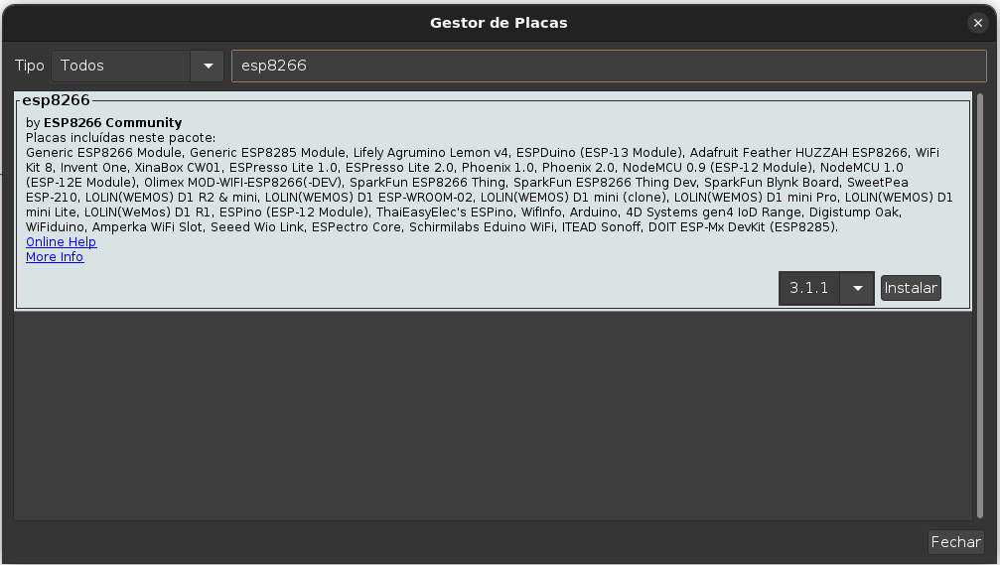
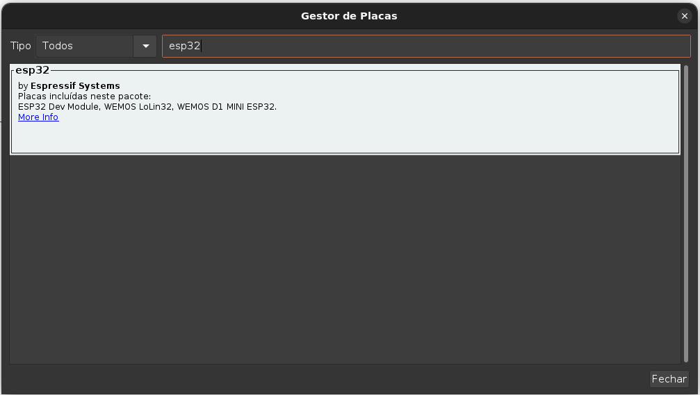

#### Referências
- [Preparando o ambiente com arduino IDE para ESP32](https://blog.eletrogate.com/conhecendo-o-esp32-usando-arduino-ide-2/)
- [Preparando o ambiente com arduino IDE para ESP8266](https://blog.smartkits.com.br/esp8266-como-programar-o-nodemcu-atraves-da-arduino-ide/)

#### Instalar as bibliotecas

* ArduinoWebsockets
* Adafruit FONA Library
* Adafruit MQTT Library
* Adafruit SleepyDog Library
* Adafruit Unified Sensor
* ArduinoJson
* AsyncElegantOTA
* DHT sensor library
* NTPClient
* PubSubClient
* WiFi101
* LittleFS_esp32
* Preferences

#### Instalar as bibliotecas .zip (fazer download do código e importar no arduino IDE)

* https://github.com/me-no-dev/ESPAsyncWebServer.git
* https://github.com/me-no-dev/ESPAsyncTCP.git

### Plugins

* Pre-requisito do arduino IDE: 

```
sudo apt install python3-serial -y
```

* Pre-requisito do ESP8266/ESP32 Exception Stack Trace Decoder:

#### Referência

1. [Arduino ESP8266/ESP32 Exception Stack Trace Decoder](https://github.com/me-no-dev/EspExceptionDecoder)

* Criar diretório se não existir

```
mkdir -p ~/Arduino/tools/
```

*  Mover o arquivo jar para dentro da pasta

```
mv ~/Downloads/EspExceptionDecoder-2.0.2.zip ~/Arduino/tools
```

* Descompactar

```
unzip EspExceptionDecoder-2.0.2.zip
```

* Remover arquivo

```
rm -rf EspExceptionDecoder-2.0.2.zip
```

* Instalar dependências

```
sudo apt install libncurses5 libpython2.7 -y
```

* Pre-requisito do ESP32 LittleFS filesystem uploader:

#### Referência

1. [Install ESP8266 NodeMCU LittleFS Filesystem Uploader in Arduino IDE](https://randomnerdtutorials.com/install-esp8266-nodemcu-littlefs-arduino/)


*  Mover o arquivo zip para dentro da pasta: `~/Arduino/tools/`

```
mv ~/Downloads/ESP8266LittleFS-2.6.0.zip ~/Arduino/tools/
```

* Descompactar

```
unzip ESP8266LittleFS-2.6.0.zip
```

* Remover arquivo

```
rm -rf ESP8266LittleFS-2.6.0.zip
```

### Compilação

1. No menu `Ferramentas`, escolha a opção `Upload Speed: "115200"`

2. No menu `Ferramentas`, escolha a opção `Flash Size: "2MB (FS:512KB OTA:~768KB)"` (**o código supera o tamanho padrão de 1.2MB para o APP**)

- **Não se esqueça de alterar as variáveis abaixo, que aparecem nos códigos do arduino e dialogflow, para as suas chaves**

| Variáveis             | Serviço               |
|-----------------------|-----------------------|
| <AIO_USERNAME>        | Adafruit              |
| <AIO_KEY>             | Adafruit              |
| <API_MINION_TOKEN>    | Base64 Basic Auth     |
| <USER_FIRMWARE>       | Upload Firmware User  |
| <PASS_FIRMWARE>       | Upload Firmware Senha |
| <API_VERSION>         | Versão da API         |


3. Clique no botão de compilação 

> Se por acaso a compilação do arduino aparecer a mensagem: `"exec: "python": executable file not found in $PATH`, faça essa instalação abaixo:

```
sudo apt install python-is-python3
```

## Extras

- Firebase para armazenamento dos áudios utilizados neste projeto
- `sonar-project.properties` para configurar o projeto a ser analisado pelo sonar.


 

 
 
 

 

 

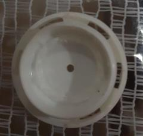 

 

 

 


## Google Home e Google Assistente

### Configurar rotinas do Google Assistant

**Comandos de voz do google assistente** 👂

  * `Ok Google, falar com o sentinela da garagem` 📣
  * `Acordar` 🌄
  * `Durma` 🌛
  * `Estressar` 😠
  * `Relaxar` 😆
  * `Como está o clima na garagem?`, `Qual a umidade?`, `Qual a temperatura?` ⛅
  * `Repita garagem` 🚗
  * `Sorria 1`, `Sorria 2` 😃
  * `Ola` 👋
  * `Café da manhã`, `Lanche`, `Janta`, `Almoço`, `Fome` 🍌
  * `Você já comeu`, `Você já jantou`, `Você já almoçou`, `Você já lanchou` 😊
  * `Rock`, `Música`, `Toca uma música aí` 🎸 🤘
  * `Lista de aplicações` 📜

[](https://www.youtube.com/watch?v=5OQWZ3kCnpA "eruption minions")

## Minimizando o Html e o Json para o Swagger

[Minifier](https://www.willpeavy.com/tools/minifier/)

## Rotas

 * GET /temperature
   * Traz a temperatura em graus celsius, farenheit e a umidade
 * GET /health
   * Checa se o ESP8266 responde
 * GET /swagger.json
   * Traz o json do swagger
 * GET /swaggerUI
   * Mostra o visual do swagger para testar a aplicação
 * POST /talk
   * Fala através do google home { "mensagem": "ola eu sou o minion da garagem" }
 * PUT /eye
   * Acende os olhos { "status": 1 }
   * Apaga os olhos { "status": 0 }
 * GET /eyes
   * Estado dos olhos
 * POST /laugh
   * Toca audio de risada HAHAHA através do Dialog Flow para google home { "midia": 1 }
   * Toca audio de risada HEHEHE através do Dialog Flow para google home { "midia": 2 }
 * PUT /hat
   * Movimenta o chapéu { "status": 1 }
   * Para o movimento do chapéu { "status": 0 }
 * GET /hats
   * Estado do chapéu
 * PUT /blink
   * Pisca a barriga em cores diferentes { "status": 1 }
   * Para de piscar a barriga{ "status": 0 } 
 * GET /blinks
   * Estado da barriga (piscando ou não)
 * GET /lists
   * Estado da lista
 * POST /list
   * Insere na lista
 * DELETE /list/del
   * Remove da lista

### Adafruit☁️

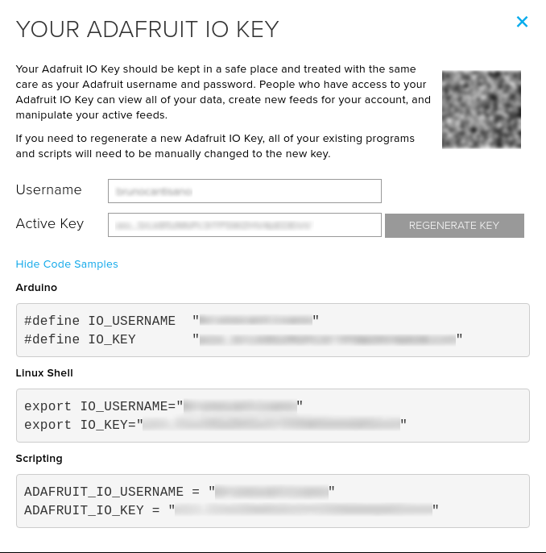
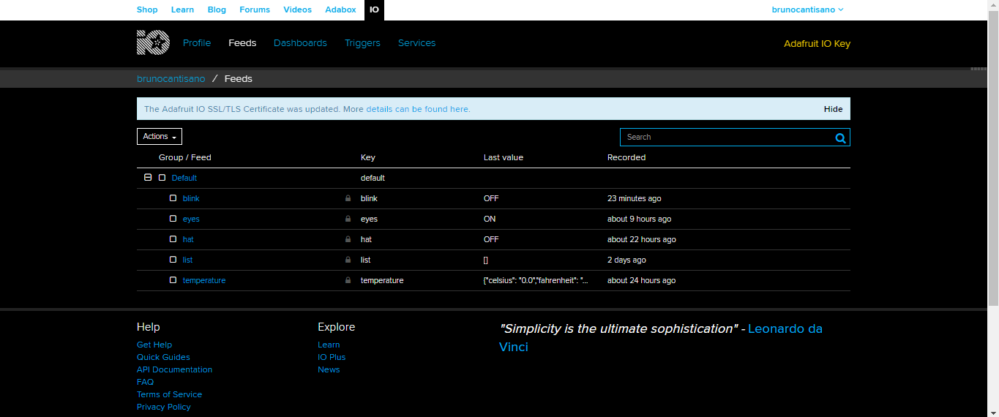


  
## APP 📱

```sh
npm run dev
```
## Referencias da placa ESP8266


 📣 No código arduino foram utilizadas as seguintes portas

| Porta       | Sensor       |
|-------------|--------------|
| D2          | Bluetooth RX |
| D3          | Bluetooth TX |
| D5          | Olhos        |
| D6          | Temperatura  |
| D7          | Chapéu       |
| D8          | Pisca        |

### Configurações de código

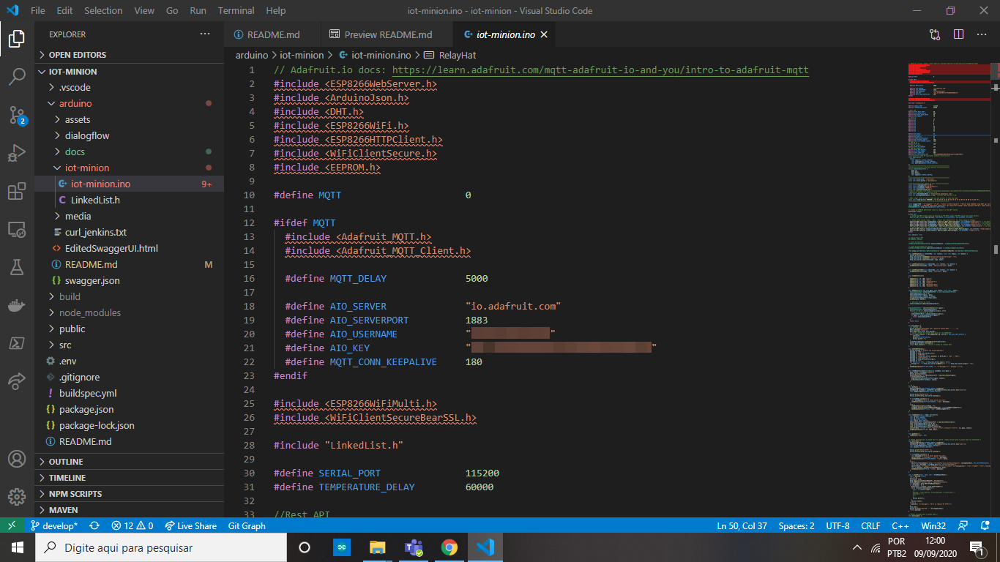
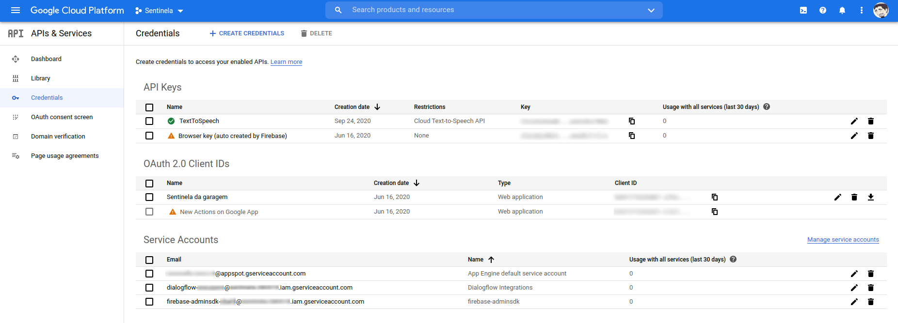

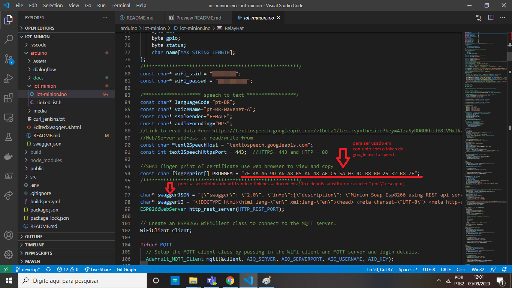
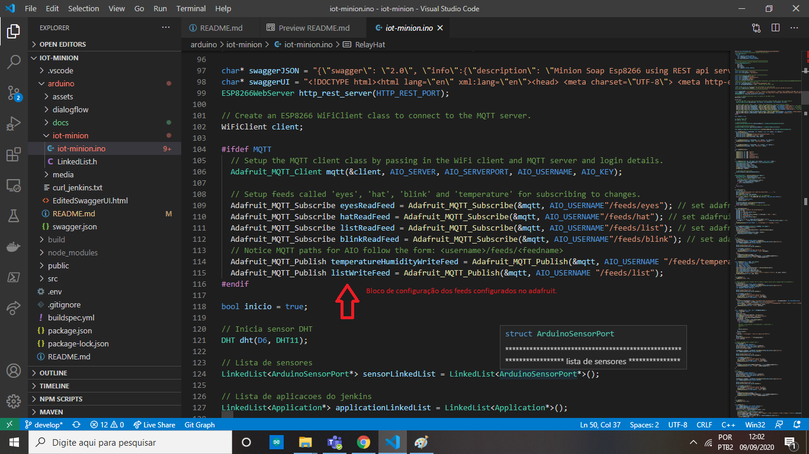

### Informação Opcional 📣

Como o IFTTT, até a presente data, não possui suporte para Google Assistant em Português, **se você não quiser usar o dialogflow com as funcionalidades de chatbot** e quiser somente mandar comandos como: `acender luz`, você pode utilizar o [IFTTT](https://www.bluelux.com.br/o-que-e-ifttt-como-ele-funciona/).

👀 **Deve-se utilizar a opção `Rotinas` do Google Home, para criar comandos em Português que direcionam para as frases em inglês do IFTTT.**

### Passos 📓

- Acesse as configurações do Google Assistant
- Selecione a opção `Rotinas`
- Cadastre a frase em português e depois a ação em inglês. Para isso é necessário utilizar o aplicativo de Celular `Home`, que é utilizado para configurar o Google Home:


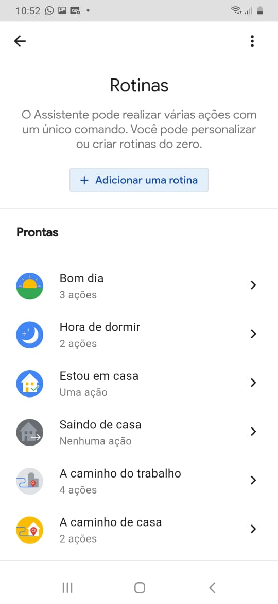


   **Faça isso com as frases para ter o comando de voz em português, por outro lado os comandos só funcionarão em inglês**

## Tecnologias 💡

- [x] [Git](https://pt.wikipedia.org/wiki/Git)
- [x] [REST](https://pt.wikipedia.org/wiki/REST)
- [x] [MQTT-Adafruit](https://io.adafruit.com/api/docs/#adafruit-io-http-api)
- [x] [Chat Bot-Dialog Flow](https://en.wikipedia.org/wiki/Dialogflow)
- [x] [IOT-Arduino ESP8266](https://pt.wikipedia.org/wiki/ESP8266)
- [x] [React](https://pt.wikipedia.org/wiki/React_(JavaScript))
- [x] [Swagger](https://swagger.io/)
- [x] [Firebase](https://en.wikipedia.org/wiki/Firebase)
- [x] [Jenkins](https://www.jenkins.io/)
- [x] [Postman](https://www.postman.com/)
- [x] [QR code](https://www.qrcode-monkey.com/)
- [x] [SonarQube](https://docs.sonarqube.org/latest/setup/get-started-2-minutes/)

## Roadmap 🚗

- [ ] [OTA para atualização do ESP8266 pelo wifi](https://randomnerdtutorials.com/esp8266-ota-updates-with-arduino-ide-over-the-air/)
- [ ] [Adicionar código Bluetooth - comunicação com o google home](https://howtomechatronics.com/tutorials/arduino/how-to-configure-pair-two-hc-05-bluetooth-module-master-slave-commands/)

## Modelos 3D 👻

[](https://free3d.com/3d-model/two-minions-ready-for-rigging-8605.html "minion")

[](https://sketchfab.com/3d-models/dr-nefario-dab-dance-af530ffc10e94117a78363f7a3b204f6 "dr nefario minions")

[](https://free3d.com/3d-model/ricken-backer-4003---bass-888215.html "Ricken Backer 4003 - Bass")

[](https://free3d.com/3d-model/classic-flying-v-54812.html "Classic Flying V")

[](https://free3d.com/3d-model/drum-set-99664.html "Drum Set")

[](https://free3d.com/3d-model/iphonex-113534.html "Iphonex")


## Links utilizados no projeto 🔗

- [Push Button](https://cssdeck.com/labs/animated-push-button)
- [Banana Button](https://www.codeseek.co/preview/weKryW)
- [Minion](https://cssdeck.com/labs/minions-css)
- [Switch Button](https://fribly.com/2015/11/28/css-minion-switch-button/)
- [React Charts](https://reactjsexample.com/a-react-environment-charts/)
- [Github Emoticons](https://gist.github.com/rxaviers/7360908)
- [API Rest - Antonio Mancuso](https://mancusoa74.blogspot.com/2018/02/simple-http-rest-server-on-esp8266.html)
- [Temperatura e umidade - DHT11](https://github.com/amiroffme/esp8266-dht11-webserver)
- [O que é DialogFlow](https://www.youtube.com/watch?v=_jCHgH9rJbI)
- [Ambiente DialogFlow](https://www.youtube.com/watch?v=Y1is5XDoiSM)
- [Integrando Dialogflow com APIs externas](https://www.youtube.com/watch?v=n4IPOeFCDxI&feature=youtu.be)
- [Audio files - Minion](https://www.soundboard.com/sb/minions "Minion_Audio_Files")
- [Firebase - Storage](https://firebase.google.com/docs/storage "Subir arquivos no Storage")


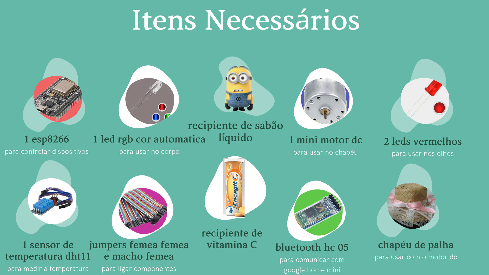
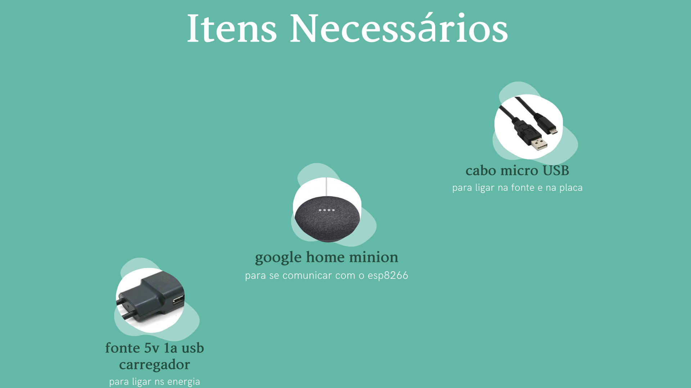


## Vídeos de referência 🎥

* [Site DC motor](https://techtutorialsx.com/2019/03/31/esp32-arduino-controlling-a-dc-motor-remotely-using-http)
* [DialogFlow1](https://www.youtube.com/watch?v=VX7SSnvpj-8&feature=youtu.be)
* [DialogFlow2](https://www.youtube.com/watch?v=5SoSjkK1OYM&feature=youtu.be)
* [DialogFlow3](https://www.youtube.com/watch?v=7iMwmZgjX6o&feature=youtu.be)
* [DialogFlow4](https://www.youtube.com/watch?v=n4IPOeFCDxI&feature=youtu.be)
* [Google Actions](https://codelabs.developers.google.com/codelabs/actions-1/#0)

## Bugs 🐛

- Em caso de encontrar algum bug, abra um pull request

## Lembrem-se: enquanto esperamos pela vacina, 💉 devemos lavar bem as mãos 💦👏🙌 e usar máscara 😷, a pandemia vai passar!
