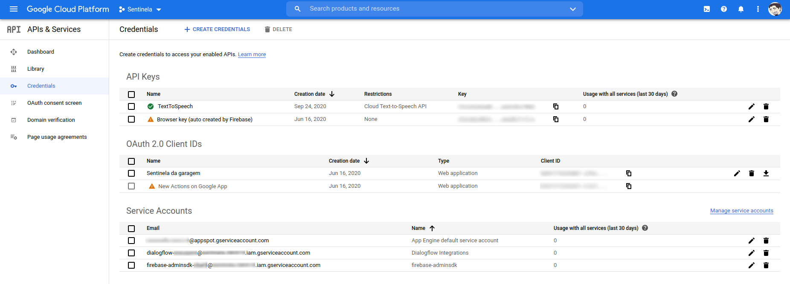

# IOT-Minion

[](https://github.com/brunocantisano/iot-minion/actions/workflows/build.yml)

[](https://github.com/Naereen/StrapDown.js/blob/master/LICENSE)


Robô caseiro feito na época da [quarentena](https://bigdata-covid19.icict.fiocruz.br/) com uma garrafa de sabonete líquido com o tema dos minions. [API](https://www.youtube.com/watch?v=OVvTv9Hy91Q&feature=emb_rel_pause) feita em REST e não SOAP. 😁


[SOAP 🆚 REST](https://www.infoq.com/br/articles/rest-soap-when-to-use-each/)

A aplicação consiste em três desenvolvimentos: 

- Backend feito na linguagem `C++` para rodar na placa [ESP32](https://pt.wikipedia.org/wiki/ESP32). Seu código-fonte encontra-se dentro da pasta `iot-minion`
- Frontend feito com a metodologia de desenvolvimento de software chamada de [PWA](https://www.garagemdigital.io/nativo-hibrido-ou-pwa), usando a linguagem `React`. Seu código-fonte encontra-se nhttps://picsart.com/i/323283806361211 pasta raíz do projeto.
- Interfaces de Conversação feita na linguagem `javascript` para ser utilizada no [Dialog Flow](https://en.wikipedia.org/wiki/Dialogflow) da Google. Encontra-se dentro da pasta `arduino/dialogFlow`

## Pre-requisitos

- [Plugin para gravar no filesystem do Esp32](https://github.com/me-no-dev/arduino-esp32fs-plugin)
- [Usando o plugin para escrever no filesystem do Esp32](https://randomnerdtutorials.com/install-esp32-filesystem-uploader-arduino-ide/)
- [Informações de uso do plugin](https://techtutorialsx.com/2018/08/24/esp32-arduino-spiffs-file-upload-ide-plugin/)
- [Arduino ESP8266/ESP32 Exception Stack Trace Decoder](https://github.com/me-no-dev/EspExceptionDecoder)
- [Preparando o ambiente com arduino IDE para ESP32](https://blog.eletrogate.com/conhecendo-o-esp32-usando-arduino-ide-2/)

* Instalando pre-requisito do arduino IDE: 

```python
sudo apt-get install python3-serial -y
```
<a href="https://brunocantisano.github.io/minion/index.html" target="_blank"></a>

- **Não se esqueça de alterar as variáveis abaixo, que aparecem nos códigos do arduino (`credentials.h`) e dialogflow, para as suas chaves:**

| Variáveis                      | Serviço                        |
|--------------------------------|--------------------------------|
| <AIO_USERNAME>                 | Adafruit                       |
| <AIO_KEY>                      | Adafruit                       |
| <API_TEXT2SPEECH_KEY>          | Google Text To Speech          |
| <FIREBASE_API_KEY>             | Firebase API Key               |
| <FIREBASE_USER_EMAIL>          | Firebase E-mail                |
| <FIREBASE_USER_PASSWORD>       | Firebase Senha                 |
| <FIREBASE_STORAGE_BUCKET_ID>   | Firebase Bucket Id             |
| <WIFI_SSID>                    | WiFi SSID                      |
| <WIFI_PASSWORD>                | WiFi Senha                     |
| <API_MINION_TOKEN>             | Base64 Basic Auth              |
| <USER_FIRMWARE>                | Upload Firmware User           |
| <PASS_FIRMWARE>                | Upload Firmware Senha          |
| <API_VERSION>                  | Versão da API                  |

## Extras

- Firebase para armazenamento dos áudios utilizados neste projeto
- `sonar-project.properties` para configurar o projeto a ser analisado pelo sonar-scanner.

## Minimizando o Html e o Json para o Swagger

[Minifier](https://www.willpeavy.com/tools/minifier/)
 
### Adafruit☁️

<a href="https://brunocantisano.github.io/minion/adafruit.html" target="_blank"></a>

## APP 📱

```sh
npm run dev
```
## Referencias da placa ESP32


 📣 No código arduino foram utilizadas as seguintes portas

| Porta       | Sensor       |
|-------------|--------------|
| 13          | Chapéu       |
| 14          | Olhos        |
| 15          | Pisca        |
| 25          | Audio        |
| 26          | Treme        |
| 27          | Temperatura  |

### Web Server

 * [Web Server](http://minion.local)
 * [Swagger](http://minion.local/swaggerUI)
 * [Swagger API](http://minion.local/swagger.json)
 
<a href="https://brunocantisano.github.io/minion/index.html#page/22#" target="_blank"></a>

### Upload de firmware


### Configurações de código



### Conversões de áudio 📓

- Utilize o audacity para realizar as conversões para o caso de utilizar os seus audios customizados
- Os arquivos devem estar no formato wav com unsigned 8 bits PCM, 16000 Hz, mono e com qualidade de 128kbps.

<a href="https://brunocantisano.github.io/minion/index.html#page/22" target="_blank"></a>

   **Os audios utilizados já foram convertidos, basta subir para o seu storage no firebase**

## Tecnologias 💡

- [x] [Git](https://pt.wikipedia.org/wiki/Git)
- [x] [REST](https://pt.wikipedia.org/wiki/REST)
- [x] [MQTT-Adafruit](https://io.adafruit.com/api/docs/#adafruit-io-http-api)
- [x] [IOT-Arduino ESP32](https://pt.wikipedia.org/wiki/ESP32)
- [x] [React](https://pt.wikipedia.org/wiki/React_(JavaScript))
- [x] [Swagger](https://swagger.io/)
- [x] [Firebase](https://en.wikipedia.org/wiki/Firebase)
- [x] [Jenkins](https://www.jenkins.io/)
- [x] [Postman](https://www.postman.com/)
- [x] [QR code](https://www.qrcode-monkey.com/)
- [x] [SonarQube](https://docs.sonarqube.org/latest/setup/get-started-2-minutes/)
- [x] [OTA para atualização do ESP32 pelo wifi](https://www.filipeflop.com/blog/atualizacao-de-software-ota-over-the-air-no-esp32/)
- [x] [ElegantOTA-update de firmware e filesystem](https://randomnerdtutorials.com/esp32-ota-over-the-air-arduino/)

## Roadmap 🚗

- [ ] [Adicionar código Bluetooth - comunicação com o google home](https://howtomechatronics.com/tutorials/arduino/how-to-configure-pair-two-hc-05-bluetooth-module-master-slave-commands/)

## Modelos 3D 👻

[](https://brunocantisano.github.io/minion/3d.html)


<table>
    <tr>
        <td align="center"><a href="https://free3d.com/3d-model/two-minions-ready-for-rigging-8605.html"><br /><sub><b>Minion</b></sub></a><br />
        </td>
        <td align="center"><a href="https://sketchfab.com/3d-models/dr-nefario-dab-dance-af530ffc10e94117a78363f7a3b204f6"><br /><sub><b>Dr Nefário</b></sub></a><br />
        </td>
        <td align="center"><a href="https://free3d.com/3d-model/ricken-backer-4003---bass-888215.html"><br /><sub><b>Ricken Backer Bass</b></sub></a><br />
        </td>
        <td align="center"><a href="https://free3d.com/3d-model/classic-flying-v-54812.html"><br /><sub><b>Classic Flying V</b></sub></a><br />
        </td>
        <td align="center"><a href="https://free3d.com/3d-model/drum-set-99664.html"><br /><sub><b>Drum Set</b></sub></a><br />
        </td>
        <td align="center"><a href="https://free3d.com/3d-model/iphonex-113534.html"><br /><sub><b>Iphonex</b></sub></a><br />
        </td>
    </tr>
</table>

## Links utilizados no projeto 🔗

- [Push Button](https://cssdeck.com/labs/animated-push-button)
- [Banana Button](https://www.codeseek.co/preview/weKryW)
- [Minion](https://cssdeck.com/labs/minions-css)
- [Switch Button](https://fribly.com/2015/11/28/css-minion-switch-button/)
- [React Charts](https://reactjsexample.com/a-react-environment-charts/)
- [Github Emoticons](https://gist.github.com/rxaviers/7360908)
- [API Rest - Antonio Mancuso](https://mancusoa74.blogspot.com/2018/02/simple-http-rest-server-on-esp8266.html)
- [Temperatura e umidade - DHT11](https://github.com/amiroffme/esp8266-dht11-webserver)
- [Audio files - Minion](https://www.soundboard.com/sb/minions "Minion_Audio_Files")
- [Firebase - Storage](https://firebase.google.com/docs/storage "Subir arquivos no Storage")
- [Conexão Wifi selecionada pelo Bluetooth](https://robotzero.one/esp32-wi-fi-connection-bluetooth/)
- [Tocando audio pelo Esp32](https://circuitdigest.com/microcontroller-projects/esp32-based-audio-player)
- [Pipeline no github action para projetos arduino](https://medium.com/swlh/how-to-create-an-automated-build-pipeline-for-your-arduino-project-1df9826f2a5e)
- [Async Web Server Upload de arquivos](https://github.com/smford/esp32-asyncwebserver-fileupload-example/blob/master/example-01/example-01.ino)
- [Evitando apertar botão de reset para upload de código](https://randomnerdtutorials.com/solved-failed-to-connect-to-esp32-timed-out-waiting-for-packet-header/)
- [Criptografia](https://portal.vidadesilicio.com.br/seguranca-de-dados-com-aes/)
- [Bluetooth Google Assistant](https://support.google.com/assistant/answer/9281916#zippy=%2Cuse-your-voice)
- [Explicação sobre umidade do ar](https://www.cgesp.org/v3/umidade-relativa-do-ar.jsp
)
- [HTTPS failure with low free heap memory](https://github.com/espressif/arduino-esp32/issues/2175)
- [How to use the PSRAM with ArduinoJson](https://arduinojson.org/v6/how-to/use-external-ram-on-esp32/)
- [Página HTML+CSS para exibição de imagens](https://codepen.io/diemoritat/pen/LKROYZ)
- [Base64 encode](https://www.dfrobot.com/blog-1210.html)
- [Base64 decode](https://www.dfrobot.com/blog-1199.html)
- [Load Wav File](https://www.xtronical.com/i2s-ep3/)
- [Converte binário para hexadecimal](http://tomeko.net/online_tools/file_to_hex.php?lang=en)
- [Audio para Google Assistente](https://github.com/pschatzmann/ESP32-A2DP)
- [Escaneamento 3D](https://www.youtube.com/watch?v=zj_Fow9lvc0)
- [Criando threads no ESP32](https://techtutorialsx.com/2017/05/06/esp32-arduino-creating-a-task/)
- [Visualizar imagens como livro](http://www.turnjs.com/)
- [ESP32 com métricas para prometheus](https://github.com/douglaszuqueto/esp32-prometheus)
- [Write binary file to SPIFFS](https://github.com/zenmanenergy/ESP8266-Arduino-Examples/blob/master/helloworld_read_write_text_file/file.ino)
-[ESP32: HTTPS web server](https://techtutorialsx.com/2019/04/07/esp32-https-web-server/
)
## Vídeos de referência 🎥

* [Site DC motor](https://techtutorialsx.com/2019/03/31/esp32-arduino-controlling-a-dc-motor-remotely-using-http)

## Peças

<table>
    <tr>
        <td align="center"><a href="https://produto.mercadolivre.com.br/MLB-2042867002-micro-motor-dc-3v-vibraco-vibracall-5-pecas-celular-pager-_JM?matt_tool=40343894&matt_word=&matt_source=google&matt_campaign_id=14303413655&matt_ad_group_id=125984293117&matt_match_type=&matt_network=g&matt_device=c&matt_creative=539354956680&matt_keyword=&matt_ad_position=&matt_ad_type=pla&matt_merchant_id=507180778&matt_product_id=MLB2042867002&matt_product_partition_id=1404886571418&matt_target_id=aud-315891067179:pla-1404886571418&gclid=EAIaIQobChMIzOug37jt9AIVxdzICh0bSwGnEAQYAiABEgL8KvD_BwE"><br /><sub><b>1-Motor vibra call</b></sub></a><br />
        </td>
        <td align="center"><a href="https://produto.mercadolivre.com.br/MLB-1353051721-20-led-flash-5mm-rgb-alto-brilho-lento-2-pin-cor-automatica-_JM?matt_tool=56291529&matt_word=&matt_source=google&matt_campaign_id=14303413604&matt_ad_group_id=125984287157&matt_match_type=&matt_network=g&matt_device=c&matt_creative=539354956218&matt_keyword=&matt_ad_position=&matt_ad_type=pla&matt_merchant_id=164968240&matt_product_id=MLB1353051721&matt_product_partition_id=1404886571258&matt_target_id=aud-1457490208988:pla-1404886571258&gclid=CjwKCAiArOqOBhBmEiwAsgeLmYz9lBnG_pNvFYrp1jvWBnjUr7PzNy1FyH0LaA6pvpBPgAPm6Tf7DRoCJHUQAvD_BwE"><br /><sub><b>1-Led Rgb Cor Automática</b></sub></a><br />
        </td>
        <td align="center"><a href="https://produto.mercadolivre.com.br/MLB-1800879468-led-vermelho-difuso-5mm-50-unidades-eletrnica-arduino-_JM?matt_tool=56291529&matt_word=&matt_source=google&matt_campaign_id=14303413604&matt_ad_group_id=125984287157&matt_match_type=&matt_network=g&matt_device=c&matt_creative=539354956218&matt_keyword=&matt_ad_position=&matt_ad_type=pla&matt_merchant_id=310832918&matt_product_id=MLB1800879468&matt_product_partition_id=1435016894331&matt_target_id=pla-1435016894331&gclid=CjwKCAiArOqOBhBmEiwAsgeLmbnvvMu-Yn9KMhgQkwQGaMeUJbqecAT_ruqnkHSVPk6Nbm1HMeirRhoC1EsQAvD_BwE"><br /><sub><b>2-Led Vermelho</b></sub></a><br />
        </td>
        <td align="center"><a href="https://produto.mercadolivre.com.br/MLB-1735283882-40-jumpers-macho-fmea-20cm-cabo-fios-protoboard-jumper-_JM?matt_tool=56291529&matt_word=&matt_source=google&matt_campaign_id=14303413604&matt_ad_group_id=125984287157&matt_match_type=&matt_network=g&matt_device=c&matt_creative=539354956218&matt_keyword=&matt_ad_position=&matt_ad_type=pla&matt_merchant_id=280311926&matt_product_id=MLB1735283882&matt_product_partition_id=1404886571258&matt_target_id=aud-615548715344:pla-1404886571258&gclid=CjwKCAiArOqOBhBmEiwAsgeLmegdNyfSJLVYgYEmbQR87zuYKnnv_xfrjt4CkfrT8n_qvDAVwoB_MhoCU4cQAvD_BwE"><br /><sub><b>Jumpers Macho Fêmea 20cm</b></sub></a><br />
        </td>
        <td align="center"><a href="https://produto.mercadolivre.com.br/MLB-1558103893-cabo-carregador-micro-usb-reforcado-amazon-kindle-paperwhite-_JM#searchVariation=65550515777&position=8&search_layout=stack&type=pad&tracking_id=72b4bc71-d5d4-44a1-923a-e238b35bb2b1&is_advertising=true&ad_domain=VQCATCORE_LST&ad_position=8&ad_click_id=MWRiZjFkNWItMzhkYy00Mjg4LTlmMzItOGM5MmQwOTUwZDU2"><br /><sub><b>1-Cabo Carregador Micro Usb</b></sub></a><br />
        </td>
    </tr>
    <tr>
        <td align="center"><a href="https://produto.mercadolivre.com.br/MLB-2012169907-carregador-tomada-plug-adaptador-fonte-usb-5v-20a-bivolt-_JM#position=9&search_layout=stack&type=pad&tracking_id=b5581a28-4201-43aa-aae7-51d7b4fc0720&is_advertising=true&ad_domain=VQCATCORE_LST&ad_position=9&ad_click_id=NzY5ZWQxY2EtMTkxYy00ZjQ3LTliZjgtMzkxMmFhOTQ1ZjU3"><br /><sub><b>1-Carregador Usb 5v 2A</b></sub></a><br />
        </td>
        <td align="center"><a href="https://produto.mercadolivre.com.br/MLB-1992594677-motor-dc-pdvd-c-clump-_JM#position=1&search_layout=stack&type=item&tracking_id=4c89883c-e7af-4b0e-b7ad-7df39b293cd2"><br /><sub><b>1-Motor Dc</b></sub></a><br />
        </td>
        <td align="center"><a href="https://produto.mercadolivre.com.br/MLB-2043197044-esp32-doit-devkit-com-esp32-wroom-32d-e-certif-anatel-_JM#position=3&search_layout=grid&type=item&tracking_id=2c3c3ec4-ef59-470a-995f-79bef8f8936f"><br /><sub><b>1-Esp32</b></sub></a><br />
        </td>
        <td align="center"><a href="https://www.mercadolivre.com.br/google-home-mini-com-asistente-virtual-google-assistant-charcoal-110v220v/p/MLB15541915?pdp_filters=category:MLB278167#searchVariation=MLB15541915&position=2&search_layout=grid&type=product&tracking_id=fd2918d9-8ccd-4ffd-881c-e407e1b52d0d"><br /><sub><b>1-Google Home Mini</b></sub></a><br />
        </td>
        <td align="center"><a href="https://produto.mercadolivre.com.br/MLB-750803825-dht11-modulo-sensor-temp-umidade-arduino-esp8266-_JM?matt_tool=40343894&matt_word=&matt_source=google&matt_campaign_id=14303413655&matt_ad_group_id=125984293117&matt_match_type=&matt_network=g&matt_device=c&matt_creative=539354956680&matt_keyword=&matt_ad_position=&matt_ad_type=pla&matt_merchant_id=325976021&matt_product_id=MLB750803825&matt_product_partition_id=1404886571418&matt_target_id=aud-1457490208988:pla-1404886571418&gclid=CjwKCAiArOqOBhBmEiwAsgeLmamL3b46VP1gsx7S2CZZ2odSHwNrvpDnzL7aIVHiAol9rn9POd-mxBoCIXEQAvD_BwE"><br /><sub><b>1-Dht11 Modulo Sensor Temp Umidade</b></sub></a><br />
        </td>
    </tr>
    <tr>
        <td align="center"><a href="https://www.vespoliprofumi.com/it/linea-bambini-walt-disney/4524-minions-bagnoschiuma-3d-per-bambini-500-ml-con-dispenser-663350066289.html"><br /><sub><b>1-Recipiente de sabão líquido dos minions</b></sub></a><br />
        </td>
        <td align="center"><a href="https://produto.mercadolivre.com.br/MLB-2001780570-mini-chapeu-de-palha-boneca-dog-para-decoraco-12cm-loja-_JM?matt_tool=58936140&matt_word=&matt_source=google&matt_campaign_id=14300471974&matt_ad_group_id=127611133362&matt_match_type=&matt_network=g&matt_device=c&matt_creative=539425454119&matt_keyword=&matt_ad_position=&matt_ad_type=pla&matt_merchant_id=485086757&matt_product_id=MLB2001780570&matt_product_partition_id=1397999322603&matt_target_id=pla-1397999322603&gclid=CjwKCAiArOqOBhBmEiwAsgeLmQKhPbiOyBsXihZ57dU2UC5CT7eD2qIJbhmy8v5kflBRG1RbKav-_xoCs9sQAvD_BwE"><br /><sub><b>1-Chapéu de palha</b></sub></a><br />
        </td>
        <td align="center"><a href="https://produto.mercadolivre.com.br/MLB-2130299507-brinquedo-lanca-gira-helice-pirocoptero-com-luz-crianca-_JM#position=3&search_layout=grid&type=item&tracking_id=505acd45-b47c-4456-83e0-84137f18b30d"><br /><sub><b>1-Hélice de pirulito pirocoptero</b></sub></a><br />
        </td>
        <td align="center"><a href="https://produto.mercadolivre.com.br/MLB-1264850017-lm386-modulo-amplificador-de-audio-arduino-_JM#position=2&search_layout=grid&type=item&tracking_id=9009ce70-9c90-40c2-aa83-acce30ec4ce1"><br /><sub><b>1-Lm386 Modulo Amplificador De Áudio - Arduino</b></sub></a><br />
        </td>
        <td align="center"><a href="https://www.usinainfo.com.br/mini-alto-falante/mini-alto-falante-2w-4-ohms-50mm-para-projetos-yd50-5683.html"><br /><sub><b>1-Mini Alto-falante 2W 4 Ohms 50mm </b></sub></a><br />
        </td>
    </tr>
</table>

## Certificado

- [text2speech.crt](iot-minion/data/text2speech.crt)

## Bugs 🐛

- Em caso de encontrar algum bug, abra um pull request


## Lembrem-se:

**Devemos:**
* Lavar bem as mãos 💦👏🙌
* Evitar aglomerações
    
* Usar máscara 😷

A pandemia vai passar!

**💉 VACINA SIM 💉**

