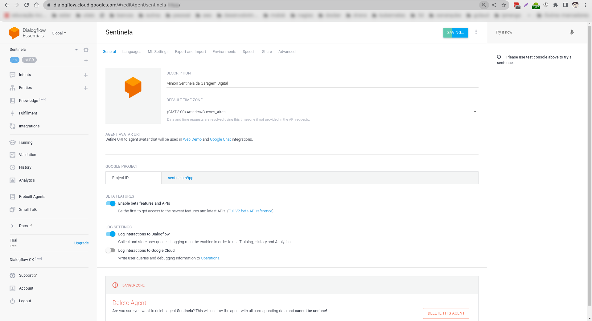

## Google Home

### Pre requisitos

### Configurar rotinas do Google Assistant

**Comandos de voz** 👂

  * `Ok Google, falar com o sentinela da garagem` 📣
  * `Acordar` 🌄
  * `Durma` 🌛
  * `Estressar` 😠
  * `Relaxar` 😆
  * `Como está o clima na garagem?`, `Qual a umidade?`, `Qual a temperatura?` ⛅
  * `Repita garagem` 🚗
  * `Sorria 1`, `Sorria 2` 😃
  * `Ola` 👋
  * `Café da manhã`, `Lanche`, `Janta`, `Almoço`, `Fome` 🍌
  * `Você já comeu`, `Você já jantou`, `Você já almoçou`, `Você já lanchou` 😊
  * `Rock`, `Música`, `Toca uma música aí` 🎸 🤘
  * `Lista de aplicações` 📜

### Informação Opcional 📣

Como o IFTTT, até a presente data, não possui suporte para Google Assistant em Português, **se você não quiser usar o dialogflow com as funcionalidades de chatbot** e quiser somente mandar comandos como: `acender luz`, você pode utilizar o [IFTTT](https://www.bluelux.com.br/o-que-e-ifttt-como-ele-funciona/).

👀 **Deve-se utilizar a opção `Rotinas` do Google Home, para criar comandos em Português que direcionam para as frases em inglês do IFTTT.**

### Passos 📓

- Acesse as configurações do Google Assistant
- Selecione a opção `Rotinas`
- Cadastre a frase em português e depois a ação em inglês. Para isso é necessário utilizar o aplicativo de Celular `Home`, que é utilizado para configurar o Google Home:

   **Faça isso com as frases para ter o comando de voz em português, por outro lado os comandos só funcionarão em inglês**

## Tecnologias 💡

- [x] [Chat Bot-Dialog Flow](https://en.wikipedia.org/wiki/Dialogflow)

## Links utilizados no projeto 🔗

- [O que é DialogFlow](https://www.youtube.com/watch?v=_jCHgH9rJbI)
- [Ambiente DialogFlow](https://www.youtube.com/watch?v=Y1is5XDoiSM)
- [Integrando Dialogflow com APIs externas](https://www.youtube.com/watch?v=n4IPOeFCDxI&feature=youtu.be)

## Vídeos de referência 🎥

* [DialogFlow1](https://www.youtube.com/watch?v=VX7SSnvpj-8&feature=youtu.be)
* [DialogFlow2](https://www.youtube.com/watch?v=5SoSjkK1OYM&feature=youtu.be)
* [DialogFlow3](https://www.youtube.com/watch?v=7iMwmZgjX6o&feature=youtu.be)
* [DialogFlow4](https://www.youtube.com/watch?v=n4IPOeFCDxI&feature=youtu.be)
* [Google Actions](https://codelabs.developers.google.com/codelabs/actions-1/#0)
